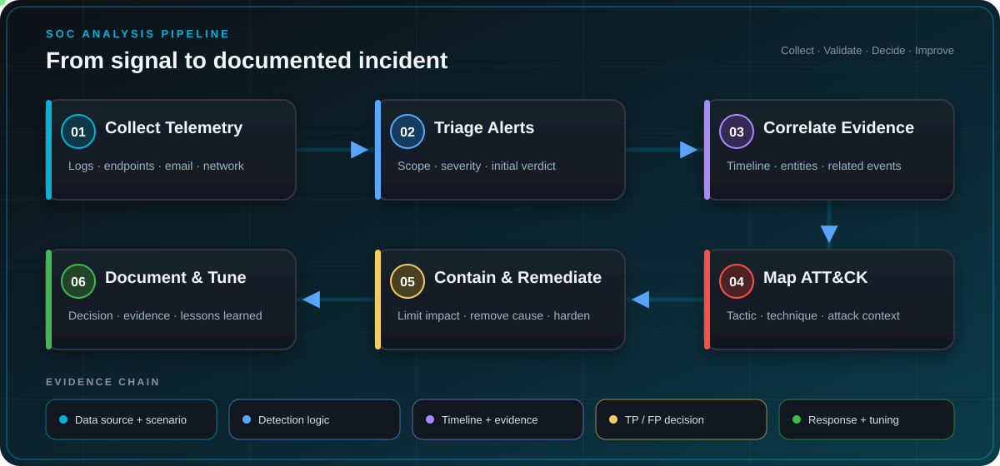
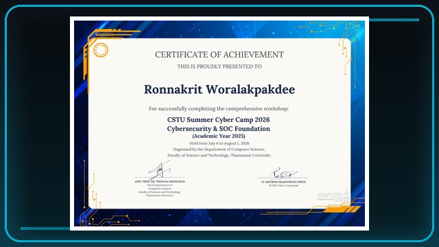
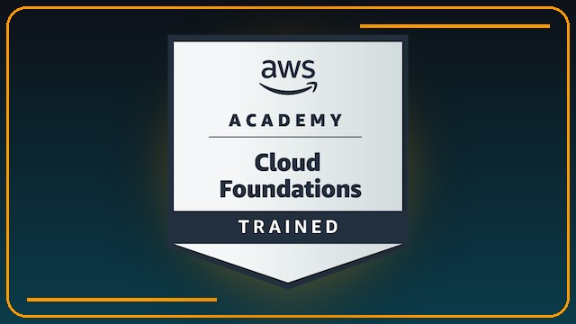
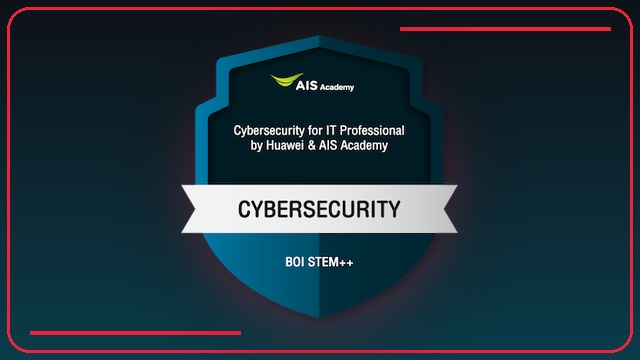
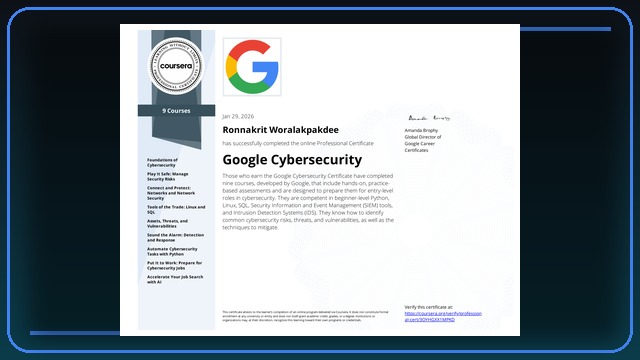
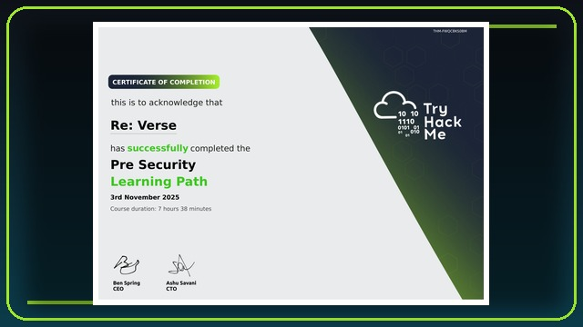
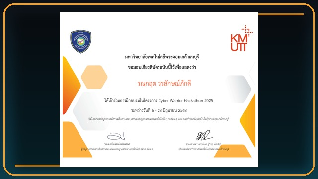

### Aspiring SOC Analyst & Blue Team Practitioner

I am a third-year Computer Science student at **Thammasat University** with a focus on Blue Team security, threat detection, and incident analysis. I build hands-on security labs that turn raw telemetry into actionable detections, validate alerts through controlled attack simulations, and document the complete incident lifecycle.

---

## About Me

- Monitor and investigate **endpoint, authentication, and email telemetry**.
- Build detection logic with **Wazuh and custom correlation rules**.
- Map adversary behavior to **MITRE ATT&CK** and document evidence, severity, response, and remediation.
- Continuously improve through practical labs and incident reports.
- Seeking a **Cybersecurity / SOC Internship** where I can apply and grow my defensive security skills.

> **Current direction:** Security Operations Center, Blue Team, Detection Engineering, and Threat Hunting.

---

## Education

**B.Sc. in Computer Science** 
Faculty of Science and Technology, Thammasat University 
August 2024 - Present | **GPAX: 3.40**

---

## Featured Security Engineering

| Project | What I Built and Validated | Security Stack |
|---|---|---|
| **[Wazuh Phishing Detection Lab](https://github.com/ronnakrit303/wazuh-phishing-detection-lab)** | Deployed a multi-host SIEM lab, collected Postfix telemetry, created a custom **Wazuh Level 10** phishing rule, investigated the alert, and mapped the activity to **MITRE ATT&CK T1566.002**. | Wazuh, Postfix, Ubuntu, Kali Linux, MITRE ATT&CK |
| **[SSH Brute-Force Incident Investigation](https://github.com/ronnakrit303/SOC-Incident-SSH-Bruteforce)** | Investigated repeated SSH failures followed by successful unauthorized access. Analyzed Linux authentication logs, classified the case as a high-severity true positive, mapped **T1110** and **T1078**, and produced a formal SOC incident report with containment and remediation steps. | Linux, OpenSSH, Log Analysis, Incident Response, MITRE ATT&CK |

---

## Detection & Investigation Workflow

  

Every project follows the evidence from its source to a defensible decision, documented response, and detection-tuning opportunity.

---

## Security Toolbox

### SIEM, Detection & Threat Analysis

### Systems, Network & Telemetry

### Programming & Engineering Tools

---

## Certifications & Training

<table>
  <tr>
    <td width="200" align="center">
      
    </td>
    <td>
      <strong>Cybersecurity &amp; SOC Foundation</strong> 
      <em>CSTU Summer Cyber Camp 2026</em> 
      Completed hands-on training in security operations, Linux, networking, web security, and digital forensics. 
      <a href="https://drive.google.com/file/d/1sK21iKJG1Vu3DgnK5LE_yY8_W56OxR1J/view?usp=drive_link">View Certificate &#8599;</a>
    </td>
  </tr>
  <tr>
    <td width="200" align="center">
      
    </td>
    <td>
      <strong>AWS Academy Graduate - Cloud Foundations</strong> 
      <em>Amazon Web Services Training and Certification</em> 
      Validated foundational knowledge of AWS Cloud concepts, core services, security, architecture, pricing, and support. 
      <a href="https://www.credly.com/badges/c6578a06-7339-41ac-8c44-2a5d4a60d87d/public_url">Verify on Credly &#8599;</a>
    </td>
  </tr>
  <tr>
    <td width="200" align="center">
      
    </td>
    <td>
      <strong>Cybersecurity for IT Professional</strong> 
      <em>Huawei &amp; AIS Academy</em> 
      Covered security policy design, firewall and NAT configuration, high availability, IPS, PKI, and security incident management. 
      <a href="https://www.credly.com/badges/edb4ff79-d02e-4b66-b804-715b6f140ffd/public_url">Verify on Credly &#8599;</a>
    </td>
  </tr>
  <tr>
    <td width="200" align="center">
      
    </td>
    <td>
      <strong>Google Cybersecurity Professional Certificate</strong> 
      <em>Google / Coursera</em> 
      Completed nine courses covering networks, Linux, SQL, SIEM, IDS, threat detection, incident response, and Python fundamentals. 
      <a href="https://coursera.org/share/ecd8315eaee1d18ac16d1770f3715ce8">Verify on Coursera &#8599;</a>
    </td>
  </tr>
  <tr>
    <td width="200" align="center">
      
    </td>
    <td>
      <strong>Pre Security Learning Path</strong> 
      <em>TryHackMe</em> 
      Completed foundational hands-on training in networking, web technologies, operating systems, and cybersecurity fundamentals. 
      <a href="https://tryhackme-certificates.s3-eu-west-1.amazonaws.com/THM-FWQCBKS0BM.pdf">View Certificate &#8599;</a>
    </td>
  </tr>
  <tr>
    <td width="200" align="center">
      
    </td>
    <td>
      <strong>Cyber Warrior Hackathon 2025 - Training Program</strong> 
      <em>KMUTT &amp; Cyber Crime Investigation Bureau</em> 
      Completed a cybersecurity training program delivered as part of the Cyber Warrior Hackathon 2025. 
      <a href="https://drive.google.com/file/d/1VezzmwH-NebVvSK57fi1keRgKI7nj2XB/view?usp=drive_link">View Certificate &#8599;</a>
    </td>
  </tr>
</table>

---

## Cybersecurity Activities

- **Thailand Cyber Top Talent 2026:** Competed in a national-level team CTF and achieved **4,500+ points** across multiple security domains.
- **CSTU Summer Cyber Camp 2026:** Completed **7+ hands-on labs** and solved **8 CTF challenges** covering Linux, networking, web security, and digital forensics.
- **Digital Fraud Cybersecurity Hackathon:** Collaborated on an AI-driven behavioral risk detection framework for adaptive trust evaluation.
- **Cyber Warrior Hackathon 2025:** Helped design a graph-based prototype for detecting mule-account transaction patterns.

---

## What I Am Building Toward

- Higher-fidelity detections with clear assumptions and false-positive analysis.
- Repeatable SOC playbooks for alert triage, investigation, containment, and closure.
- Detection-as-code workflows with testing, version control, and evidence-driven tuning.
- Stronger coverage across identity, endpoint, network, and email telemetry.
- Security automation that reduces repetitive analyst work without removing human judgment.

---

### Open to feedback, collaboration, and opportunities to grow in defensive security.

All attack activity shown in these repositories was performed in isolated, authorized lab environments. Public evidence is sanitized before publication.

  

